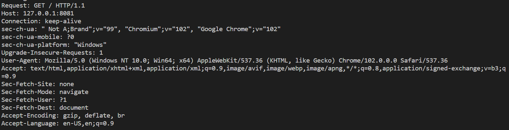
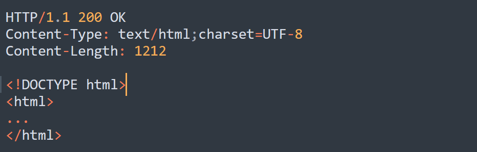

<h1 align="center">MultiThreaded WebServer</h1>

## Overview
Every website we visit is hosted on a HTTP/HTTPS servers. HTTPS is same as HTTP with more security. This is a web server that can handle multiple clients(web browsers) simultaneously. There is a pool of threads waiting for a connection, whenever the server receives a `GET` request it delivers the file from the current directory. Since each thread can handle requests independently, requests get processed faster.

## Dependencies and Running Server
In this project i have used `pthread.h` which is a header for Unix/Linux API for threads. So you will be needing a Unix/Linux based OS or , you can [install wsl](https://docs.microsoft.com/en-us/windows/wsl/install) and [configure vscode](https://code.visualstudio.com/docs/cpp/config-wsl) for windows.

First clone the repository on your local Machine using `git clone`. Then migrate to this directory and open the terminal here and type `make` and hit enter. This will compile the required files and make an executable file named as "Webserver". you can run this by typing ./Webserver in the terminal and press enter. You will see a message from the server that it is "Waiting for Connections".

Now, Open a web browser and request a simple website i made to show that the server works by typing in the URL-"http://127.0.0.1:8080/". There will be a few links which is just to show that the server is responsive to several different kinds of files(like .html,.jpg,.png,.ico,.js etc). You can also see how the server is processing requests by seeing messages in the terminal.

## Working

HTTP communications usually takes place over TCP/IP connections. By default the port is 80 but other ports can be used. So here i have implemented this server on top of TCP(Transport Layer). Creating a TCP scoket can be done in three steps :
 - Create a Socket
 - Bind Socket(Assign address to the socket)
 - listen to the socket

Now, this server is ready to accept requests by the clients. For each request we create a variable `client_socket` and push it to a queue data structure. There is a thread pool with a fixed number of threads waiting for requests. If the queue is not empty then requests from the front of the queue are popped out and a free thread will start handling that request. Here, we have a common data structure "queue" and each thread is trying to make changes(read from the top and pop the top element) to this data structure, which is not safe as this leads to `Race Condition`. To prevent this, i have used mutex locks so that only one thread access this data structure one at a time.

Since these pool of threads will continuously check the queue if there is a request even when no requests are made. This leads to wastage of CPU cycles(energy) and eventually heat up the machine. So logically a thread should check the queue only when a request comes. To implement this i used wait and signal conditions which is whenever a thread found that a queue is empty, it should stop there and wait. Now, whenever a request will arrive it will signal the thread to start executing again. This will stop the unneccesary execution of threads and will reduce CPU usage.

Now, the TCP part of the server is complete and it can receive requests in text form. A HTTP request from a client(web browser) is made by typing something like "http://www.abcd.com:80/index.html".
 - `HTTP` is the type of request
 - `www.abcd.com` is the URL(Universal Resource Locator)
 - `80` is the Server port
 - `index.html` is the file that browser fetches from the web server
 A HTTP request for a web server from a web browser lookes something like this:

 GET is the default method used by HTTP . The client sent some headers to the server and expect same in return. The client expects a similar response from server which will look something like this:

So, if we want to send a requested file to the client, we first need to create a header for the same and put a blank line and then the contents of file.

We can see there is a lot of information in the Client request but, we only need the first line to implement this server. Furst line can be divided into three parts:
- `GET`: This tells the type of HTTP request.
- `/`: This tells the file the client asks for.
- `HTTP/1.1`: This tells the version of HTTP protocol used for communication.

So, we can parse the first line and create a header accordingly, if the file exists in the root directory then we will send it to the client. Else, i have made a error page which shows that the typed url is incorrect.

## Demo Video

- [Drive Link](https://drive.google.com/file/d/1aoKskz2BUXBRiEaAuh1nrMaeUpFX_xeA/view?usp=sharing)

This is a small demo for better understanding of this project.
## Resources/References

These are links to blog posts, stack overflow pages which helped me a lot during this project.
- [HTTP Server](https://medium.com/from-the-scratch/http-server-what-do-you-need-to-know-to-build-a-simple-http-server-from-scratch-d1ef8945e4fa)
- [Stack Overflow-1](https://stackoverflow.com/questions/57113647/launching-threads-cause-segmentation-fault-on-pointer-initialization)
- [Stack Overflow-2](https://stackoverflow.com/questions/13739245/creating-a-standard-queue-of-pointers-in-c#:~:text=If%20you%20do%20not%20expose,that's%20the%20messier%20on%20collections.)
- [Socket Programming](https://www.geeksforgeeks.org/socket-programming-cc/)
